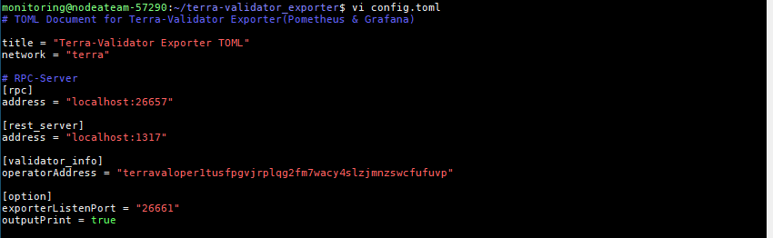

# terra-validator_exporter :satellite:


Terra 검증인을 위한 Prometheus exporter


## Introduction
Tendermint의 기본 Prometheus exporter(localhost:26657)에서 제공되지 않는 부분, 특별히 검증인의 정보를 모니터링하기 위한 exporter


## Collecting information list
> **Network**
- chainId
- blockHeight
- currentBlockTime
- bondedTokens
- notBondedTokens
- totalBondedTokens
- bondingRate
- validatorCount
- precommitRate
- proposerWalletAccountNumber

> **Validator Info**
- moniker
- accountAddress
- consHexAddress
- operatorAddress
- validatorPubKey
- votingPower
- delegatorShares
- delegatorCount
- delegationRatio
- selfDelegationAmount
- proposerPriorityValue
- proposerPriority
- proposingStatus
- validatorCommitStatus
- commissionMaxChangeRate
- commissionMaxRate
- commissionRate
- balances(uluna, ukrw, usdr, uusd)
- commission(uluna, ukrw, usdr, uusd)
- rewards(uluna, ukrw, usdr, uusd)
- minSelfDelegation
- jailed

.png)


## Quick Start
- 다운로드
```
wget https://github.com/node-a-team/terra-validator_exporter/releases/download/v0.1.0/terra-validator_exporter_v0.1.0.tar.gz
tar -xzvf terra-validator_exporter_v0.1.0.tar.gz &&  cd terra-validator_exporter
```

 - Config 설정
 1) RPC 및 Rest 서버 정보를 입력
 2) 검증인 Operator Address를 입력(```terracli keys show [Key Name] --bech=val --address```)
 3) exporter 포트 설정
 4) outPrint 설정(true로 설정할 경우 exporter에서 수집되는 정보 출력)
```
vi config.toml
```
```
# TOML Document for Terra-Validator Exporter(Pometheus & Grafana)

title = "Terra-Validator Exporter TOML"
network = "terra"

# RPC-Server
[rpc]
address = "localhost:26657"

[rest_server]
address = "localhost:1317"

[validator_info]
operatorAddress = ""

[option]
exporterListenPort = "26661"
outputPrint = true
```



 - 실행
```
./terra-validator_exporter
```

.png)


## Grafana 예시
.png)

